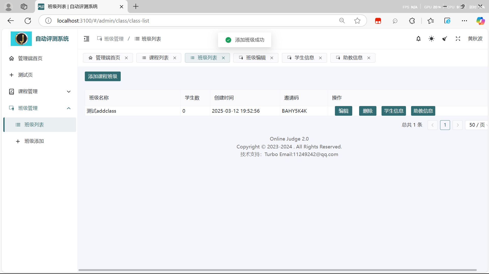

```java
findAllShoolsInAdminusers: () => request.post('/school/findAllShoolsInAdminusers')
```

这个接口用于admin显示全部的class（maybe）
但是我意外发现这个和schoolcontroller类挂钩因此不去理会。`teacher` 角色可以对班级执行以下操作：

- 查看学生 (`onClickStudent`)
- 管理助教 (`onClickAssistant`)
- 编辑班级 (`onClickEdit`)
- 删除班级 (`onClickDelete`)

```java
addClass
```

添加班级


```java
editClassMessage
```

编辑班级以及所有和admin相关的都会出现问题：由于没有schoolid我很多方法不敢加。

```java
getUserAdd
```

```java
getUserByStudentNoClassId
```