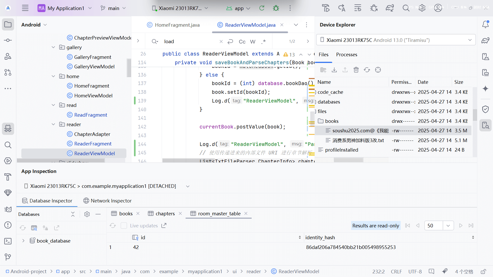

# 安卓开发-2025-4-27

## 限定域问题

1、保存数据库后，页面跳转总是出现问题，现在通过谷歌不断添加log，发现问题。

bookshelffragment作用域限定很必要。

## uri contentprovider 单向问题

2、经典的问题，当我在github中找类似的小说阅读器时，总会让我设置权限云云。这是因为外部应用提供的uri，无法直接控制对方的 ContentProvider 是否可用或 URI 是否一直有效。

因此在快看阅读中，我发现他是通过复制该文件到应用中解决的。

而github开源软件是通过强制设定权限实现的。

这里我采用快看阅读的方式解决。复制到本地如图所示

 

## Android Fragment 生命周期的重要组成部分

因为之前修改代码导致代码不全，以至于导航栏等出现错误

它们不是可选的，而是由 Android 系统在 Fragment 的不同阶段自动调用的回调方法。

虽然您的 Fragment 可能在不实现所有这些方法的情况下也能运行，但它们对于 Fragment 的正确初始化、状态管理和资源控制是必不可少的：

- **`onCreateView()`**: 这是 Fragment 创建视图的地方。您必须实现这个方法来创建和返回 Fragment 的 UI 布局。
- **`onViewCreated()`**: 在 `onCreateView()` 返回视图后调用。通常在这里进行视图的绑定和初始化工作。
- **`onStart()`**: Fragment 对用户可见时调用。在这里可以开始一些需要在 Fragment 可见时进行的任务。
- **`onResume()`**: Fragment 处于活跃状态，与用户交互时调用。通常在这里开始动画、获取传感器数据等需要 Fragment 在前台运行时进行的任务。同时，ViewModel 的 LiveData 观察者使用 `getViewLifecycleOwner()` 时，也会在 Fragment 进入 `STARTED` (after `onStart`) 和 `RESUMED` (after `onResume`) 状态时自动管理其活跃状态。
- **`onPause()`**: Fragment 即将不再与用户交互时调用。在这里应该暂停或停止一些在前台进行时的任务，释放不必要的资源。
- **`onStop()`**: Fragment 不再对用户可见时调用。在这里停止在 `onStart` 中启动的任务，进行更彻底的资源释放。
- **`onDestroyView()`**: Fragment 的视图被移除时调用。在这里清理与视图相关的资源，解除视图绑定。
- **`onDestroy()`**: Fragment 最终被销毁时调用。在这里进行最终的清理工作。

您代码中使用的 `onCreateView` 和 `onDestroyView` 是 Fragment 生命周期中必须实现的（至少 `onCreateView` 是构建 UI 所必需的）。而像 `onResume`、`onStart` 等方法，即使您没有在里面写任何代码，系统也会调用它们。它们的存在是 Fragment 与 Android 系统正常交互的基础。

特别是对于您使用 ViewModel 和 LiveData 的情况，ViewModel 的 LiveData 观察者通常会绑定到 Fragment 的生命周期（例如通过 `getViewLifecycleOwner()`）。这些观察者依赖于 `onStart` 和 `onResume` 等生命周期回调来知道何时应该变为活跃状态并接收数据更新。

所以，简而言之，这些生命周期方法是 Fragment 框架的一部分，是必要的。我们在调试时在 `onResume` 中添加日志是为了在 Fragment 处于最活跃的状态时检查特定的数据，但这并不意味着 `onResume` 本身是可以删除的（即使里面没有您的代码）。

希望这个解释能帮助您理解 Fragment 生命周期回调的重要性。