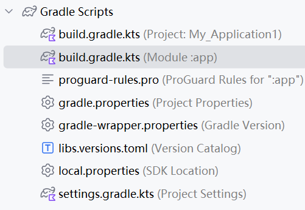

2025-4-23 安卓项目开发

我放弃了flutter，因为并没有感觉它相较于android开发有什么优势，只是多了多平台？？？

由于之前有过相关经验，同步后慢慢有了些许熟悉感，但是仍旧有许多问题未了解。

例如：安卓开 发可以用kotlin和java，但是即便是简单的java开发，依旧是有许多问题--分不清依赖，找不到在哪里更新它。文件夹分级没搞清，有很多布局不清楚。我也终于明白为什么按照书上一步一步学要从空项目学起了，这玩意不是那么简单的，就一大堆的布局就够我喝一壶。



对于图中的配置，按照我的理解，其中toml相当于是大pom，然后module级别的相当于是该模块的库，但是有点意思的是即便这样还是要import导入。

由此看来，安卓开发对于依赖版本管理等要求严格。

这个问题问得很有趣 😂 ——"**toml 和项目级别的 build 谁大？**"

用通俗一点的说法：你可以把 `libs.versions.toml` 看作是**工具箱目录**，而 `项目级别的 build.gradle.kts` 是**总指挥**。

咱们一起来梳理一下它们的"权力结构"：

------

## 🧰 `libs.versions.toml` 是干嘛的？

这是一个**版本管理文件**，专门用来集中管理所有依赖库的版本号。

比如你可以这样写：

```toml
[libraries]
room-runtime = { group = "androidx.room", name = "room-runtime", version = "2.6.1" }
```

然后你就可以在 `build.gradle.kts` 中使用别名：

```kotlin
implementation(libs.room.runtime)
```

✔️ 优点：改版本号时，不用在多个地方找，只改 `toml` 文件就可以。

但它 **只是一个数据清单**，**不会自动生效**，也没有构建能力。

------

## 🏗️ 项目级别的 `build.gradle.kts` 是干嘛的？

这个是 **整个项目的配置中心**。里面你可以：

- 命令 Gradle 用什么插件
- 指定构建逻辑
- 告诉它去哪里找 `libs.versions.toml`（别名才有用）
- 管理多个模块

它才是"**说话算数的总指挥官**"。

------

## 🥇 谁说了算？

| 比较对象             | 权限 | 说明                                               |
| -------------------- | ---- | -------------------------------------------------- |
| `libs.versions.toml` | ⭐    | 只是"图书馆管理员"：它列出了有哪些依赖和版本       |
| `build.gradle.kts`   | 🏆🏆   | 是"调度总管"：负责调用、引用、构建、打包、控制一切 |

也就是说：

> ✅ **`libs.versions.toml` 是一个"被使用的工具"**，
>  ✅ **而 `build.gradle.kts` 是"调用和执行的指挥官"**。

如果你在 `toml` 文件里定义了一个库，但在 `build.gradle.kts` 里没引用它，那它啥也干不了。

------

### 🎯 举个比喻：

假设你开了个装修公司：

- `libs.versions.toml` 就像仓库管理员，记录了你有哪些材料（地板、瓷砖、油漆），以及它们的品牌和版本。
- `build.gradle.kts` 是工头，指挥工人用哪些材料去装修每个房间。
- 如果仓库有材料但工头没说用，那材料就只能在仓库吃灰 😂

------

### ✅ 总结：

> **谁大？当然是 `build.gradle.kts` 更大！**
>
> `toml` 是材料清单，必须在 `build.gradle.kts` 中明确使用，才能参与构建。

如果你想深入了解 `toml` 如何被引入使用，或者想试试看不用 toml 直接写依赖，也可以跟我说，我都能给你演示。😎

gpt的理解不一样，toml相当于静态库，项目级别和模块级别的分别使用它？

