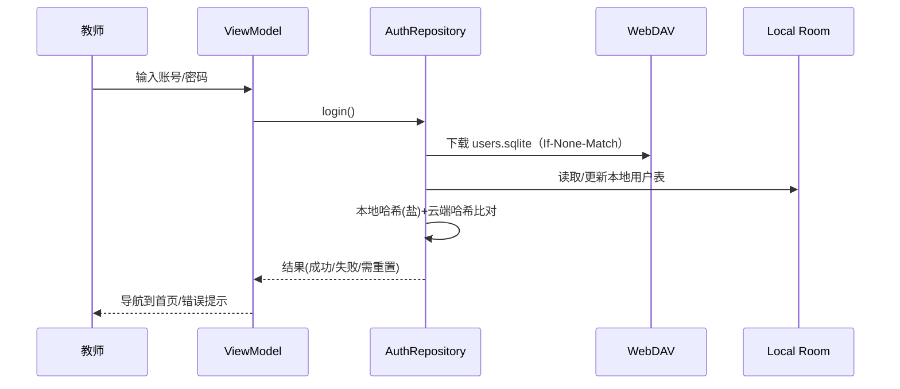
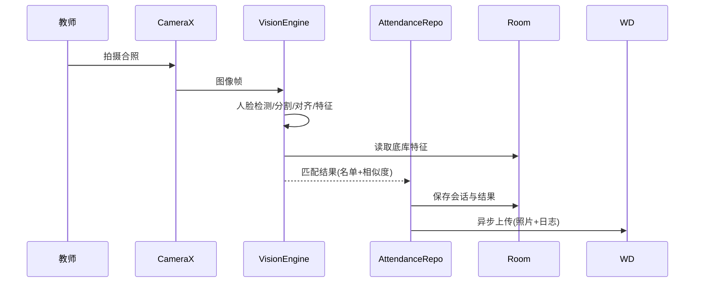
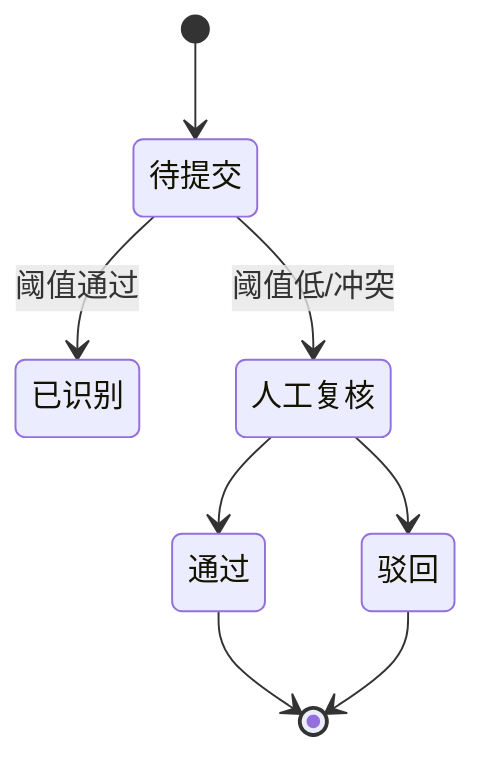

# 校园打卡（教师端）——完整方案与实施指南

> 目标：为教师提供基于安卓端的到课打卡与人脸识别核验应用，支持 WebDAV 云端同步、离线可用、班级/学生管理、调试评估、可视化动画展示与项目级工程化实践。

------

## 1. 需求分析（SRS 摘要）

### 1.1 用户角色

- **教师（主角）**：注册、登录/注销；选择班级；发起一次到课拍照；查看系统识别结果；对缺席学生发起质询/复核；手动修正结果；管理班级与学生信息、照片。
- **教务管理员（可选）**：批量导入班级/学生；审核教师；查看统计报表（后续扩展）。
- **学生（被管理对象）**：可在教师允许的情况下提交个人自拍核验（自助补签）。

### 1.2 功能需求

1. **账户体系**
   - 本地 SQLite 保存教师账户资料（**加密后**的凭据），并使用 **WebDAV** 作为远端存储：上传/下载 `users.sqlite` 与头像/学生照片等静态资源。
   - 支持：注册、登录、注销、修改密码、找回密码（通过教师的 WebDAV 账号/邮箱验证或管理员复核）。
   - 登录流程：本地输入 → 与云端（WebDAV 上的 `users.sqlite`）比对 → 返回验证结构（通过/失败/需重置）。
2. **班级/学生管理**
   - 教师登录后按 teacherId 读取其班级；增删改查班级与学生。
   - 对应学生的人脸底库（人脸特征/头像）同步至本地；支持相册/拍照导入、批量导入（ZIP）与质量检测（清晰度、人脸可见度）。
3. **打卡与识别**
   - **模式 A：合照打卡**（教师一次拍整班合照/短视频帧 → 人数检测 → 人脸分割/对齐 → 人脸特征提取 → 与底库比对 → 出席名单/缺席名单/未识别名单）。
   - **模式 B：学生自助**（学生端或教师端“学生模式”拍照 → 提交识别结果 → 教师审阅后计入）。
   - 打卡会话持久化：包含时间、地点(可选 GPS)、照片、识别日志、人工修正记录。
4. **调试与评估（演示必备）**
   - Debug 面板：人脸检测框/分割遮罩、对齐关键点、匹配相似度、阈值滑杆、耗时分布。
   - 评价指标：准确率、召回率、F1、人数误差；支持**验证集/交叉验证**与小型可复现实验。
5. **同步与离线**
   - 双向同步（**WebDAV**）：班级/学生信息 SQLite、底库存储（头像、特征）、打卡记录、日志。
   - 冲突解决策略（见 5.4）。
6. **UI/UE**
   - 高科技、简洁风：**Jetpack Compose + Material 3**，深浅色、霓虹描边/玻璃拟态（适度）。
   - 拍照页提供**分割/识别过程动画**：人脸热区涌动、分割轮廓描绘、识别成功的粒子高亮。
   - 多状态可视化：出席/缺席/未识别使用统一色谱与动态图标。

### 1.3 非功能需求

- 设备要求：Android 8.0+；中端设备流畅（30 FPS 取景）；兼容无谷歌服务环境。
- 性能：单张合照（≤ 40 人）在 5–8s 内给出结果（离线）；
- 隐私：**不上传明文密码**；本地数据库加密；敏感资源按需端到端加密。
- 可测性：模块化、可插拔算法、模拟数据注入、可重复实验脚本。

------

## 2. 总体架构

### 2.1 技术栈

- **语言/框架**：Kotlin、Jetpack Compose、CameraX、Room(ORM)、WorkManager、DataStore、Hilt、Coroutines/Flow。
- **人脸算法**（端侧）：Face Detection（MLKit/MediaPipe）、对齐与嵌入（FaceNet/MobileFaceNet/ArcFace 轻量模型），相似度（余弦/欧式）。
- **云端**：WebDAV（PUT/GET/PROPFIND/MKCOL），OkHttp 拦截器，断点续传（可选）。
- **加密**：Android Keystore + SQLCipher/Room Encryption + 文件级 AES-GCM。
- **日志/调试**：Timber、内置 Benchmark、可导出 JSON 报告。

### 2.2 模块划分

- `core-common`：错误模型、Result 封装、序列化、加密工具。
- `core-db`：Room 实体/DAO/迁移；SQLCipher 集成。
- `core-sync`：WebDAV 客户端、差异计算、冲突解决、任务编排（WorkManager）。
- `core-vision`：检测/对齐/特征/匹配；可切换实现与阈值。
- `feature-auth`：注册/登录/注销。
- `feature-roster`：班级/学生管理与底库维护。
- `feature-attendance`：合照/自助打卡、结果页、人工复核。
- `feature-debug`：调试看板、评测工具、报告导出。
- `ui-design`：主题、组件库、动画与可视化。

### 2.3 架构风格

- **MVVM**（View ↔ ViewModel ↔ Repository ↔ DataSource），单向数据流（Flow/State）。
- 依赖注入：Hilt；跨模块接口：Service Locator/Facade。
- 同步作业：离线优先（Local First），后台队列（WorkManager）。

------

## 3. 关键流程（顺序图/状态机）

> 注：以下使用 Mermaid 语法示例，便于导出文档后渲染。

### 3.1 登录与云端校验（WebDAV + SQLite 比对）



### 3.2 合照打卡识别



### 3.3 学生自助/复核流程



------

## 4. 数据设计

### 4.1 ER 图（概念）

```mermaid
erDiagram
  TEACHER ||--o{ CLASS : manages
  CLASS ||--o{ STUDENT : has
  STUDENT ||--o{ FACE_EMBEDDING : owns
  CLASS ||--o{ ATTENDANCE_SESSION : holds
  ATTENDANCE_SESSION ||--o{ ATTENDANCE_RESULT : contains
  ATTENDANCE_RESULT }o--|| STUDENT : for
  PHOTO_ASSET }o--|| ATTENDANCE_SESSION : captured
  SYNC_LOG }o--|| TEACHER : generatedBy
```

### 4.2 主要表结构（Room 实体示例）

- `Teacher(id, name, email, davUrl, davUser, davKeyEnc, createdAt, updatedAt)`
- `Classroom(id, teacherId, name, year, meta)`
- `Student(id, classId, name, sid, gender, avatarUri, createdAt)`
- `FaceEmbedding(id, studentId, modelVer, vector(BLOB), quality, createdAt)`
- `AttendanceSession(id, classId, startedAt, location, photoUri, note)`
- `AttendanceResult(id, sessionId, studentId, status{Present,Absent,Unknown}, score, decidedBy{AUTO,TEACHER}, decidedAt)`
- `PhotoAsset(id, sessionId, type{RAW,ALIGNED,DEBUG}, uri, meta)`
- `SyncLog(id, entity, entityId, op{UPSERT,DELETE}, version, ts, status)`

### 4.3 索引与约束

- 唯一：`Student(classId, sid)`；`FaceEmbedding(studentId, modelVer)`。
- 外键约束连锁删除；大量查询的列建索引（`classId`, `sessionId`）。

### 4.4 持久化与加密

- Room + SQLCipher；密钥存 Android Keystore；大文件（照片/特征）文件级 AES-GCM。

------

## 5. WebDAV 同步设计

### 5.1 目录结构（示例）

```
/dav-root/
  /teachers/{teacherId}/
    users.sqlite                # 账户库（管理员维护或公共）
    roster.sqlite               # 班级与学生、特征等（或拆分为多库）
    /classes/{classId}/
      /students/
        {studentId}/avatar.jpg
        {studentId}/embeddings/{modelVer}.bin
      /attendance/
        {sessionId}/photo.jpg
        {sessionId}/results.json
        {sessionId}/debug/
```

### 5.2 同步策略

- **离线优先**：本地操作立即生效；后台补传。
- **差量同步**：利用 ETag/Last-Modified；本地维护 `version` 与 `SyncLog`。
- **冲突解决**：
  1. 元数据（学生信息）采用 **LWW**（Last-Writer-Wins，带时区与偏移）+ 冲突日志。
  2. 嵌入文件与头像：以文件哈希判等；不同哈希并存，取最新 `modelVer`。
  3. 出勤结果：同一 `sessionId` 允许**人工覆盖**自动结果，人工优先。

### 5.3 安全

- WebDAV 凭据仅存 Keystore；传输走 HTTPS；
- 数据最小化：仅教师所属资源可见；
- 可选端到端：对 `results.json` 使用教师私钥加密。

### 5.4 同步流程（伪代码）

```
for each pending SyncLog:
  if op == UPSERT:
    PUT file or PATCH sqlite page
  else if op == DELETE:
    DELETE path
  verify via PROPFIND (ETag)
  mark success or retry with backoff
```

------

## 6. 识别算法与调试

### 6.1 流程

1. **预处理**：人脸检测（边框/关键点）→ 分割（可选）→ 对齐（仿射到标准模板）。
2. **特征**：MobileFaceNet/ArcFace 轻量模型（FP16，Android NNAPI/GPU）；
3. **匹配**：计算与底库向量的余弦相似度；Top-K + 阈值裁决；
4. **多脸投票**：同一学生若多帧命中，取最高分或时序稳定性投票；
5. **去重**：同一张合照中避免同一学生重复计入（IoU/轨迹约束）。

### 6.2 阈值与度量

- 指标：Precision、Recall、F1、TP/FP/FN、人数误差(ΔN)。
- 阈值自适应：基于验证集统计分布建议阈值；教师可在 Debug 面板微调并保存。

### 6.3 验证集/交叉验证/训练

- 数据收集：每生≥3 张不同光照/角度；
- 划分：Train/Val/Test = 6/2/2 或 K 折（K=5）；
- 训练（可选离线 PC/服务器）：冻结或微调最后全连接层；导出 TFLite/ONNX；
- 应用内评估：选定验证集运行，输出混淆矩阵、ROC/PR；导出 CSV/PNG 报告。

### 6.4 调试面板（演示项）

- 开关：显示检测框/分割遮罩/关键点；
- 面板：帧处理耗时柱状图、相似度直方图、Top-K 列表；
- 交互：点击人脸 → 显示匹配候选与分数 → 手动指认并写回结果；
- 导出：`/attendance/{sessionId}/debug/` 自动保存可回放素材。

------

## 7. 界面与交互（UI/UE）

### 7.1 设计语言

- **Jetpack Compose + Material 3**，圆角(24)、毛玻璃、微霓虹描边；
- 卡片化信息层级；统一动效（FastOutSlowIn）；
- 相机页：**动态遮罩+粒子高亮**展示分割与识别命中。

### 7.2 关键页面

1. **登录/注册**：支持扫码填充 WebDAV 地址；密码强度提示；
2. **首页**：我的班级、最近打卡、同步状态、模型版本提醒；
3. **班级管理**：列表/搜索/导入导出；学生详情（头像、特征质量、样本数）；
4. **打卡取景**：实时帧预览、识别播放条、人数计数；
5. **结果复核**：三列分栏（出席/缺席/未识别），拖拽修正；
6. **自助通道**：学生扫码进入临时页面拍照 → 待教师审批；
7. **调试**：指标面板、阈值滑杆、日志导出。

### 7.3 动效建议

- 分割轮廓描边动画（Path morphing）；
- 命中高亮粒子（Canvas 粒子喷泉）；
- 人数变更计数器（滚动数字翻页）。

------

## 8. 实现要点（代码层面建议）

### 8.1 Room（ORM）

- `@Entity` + `@Relation` 建立一对多；
- DAO 使用 `Flow` 实时更新 UI；
- 复杂事务采用 `@Transaction`；
- 数据迁移 `AutoMigration` + 手写迁移脚本（向后兼容）。

### 8.2 CameraX 与图像管线

- 采用 `ImageAnalysis.STRATEGY_KEEP_ONLY_LATEST`；
- 胶片快照：拍摄后锁定曝光/白平衡，保证一致性；
- 大图压缩与 EXIF 保留；影像缓存 LRU。

### 8.3 WebDAV 客户端

- OkHttp + 自定义 `WebDavInterceptor`（PROPFIND/MKCOL/ETag）；
- 大文件分块 PUT；失败指数退避+网络变化触发重试。

### 8.4 安全

- Keystore 生成对称密钥，文件 AES-GCM；
- 敏感日志脱敏；调试包与生产包开关不同权限。

------

## 9. 测试方案

### 9.1 等价类 & 边界值

- 账户：合法/非法邮箱；弱/强密码；离线/弱网/证书错误；
- 同步：新增/修改/删除/冲突；大批量（1000+ 学生）；
- 识别：光照强/弱、遮挡/口罩、侧脸、多人密集；
- 性能：40 人合照，目标 < 8s；
- 安全：数据库密钥遗失、设备丢失；
- 可用性：单手操作、色盲模式（对比度>= 4.5:1）。

### 9.2 自动化

- 单元：Repository/UseCase/DAO Mock；
- 仪器：CameraX 伪数据源；
- UI：Compose Test Rule + 快照测试；
- 基准：Macrobenchmark 记录首帧/识别耗时。

### 9.3 评估报告

- 自动生成 CSV/JSON（TP/FP/FN/Precision/Recall/F1/ΔN）；
- 导出图表（ROC/PR/耗时分布）与会话回放包。

------

## 10. 项目管理与计划

### 10.1 规模与成本（粗估）

- 端侧开发：2 人月（架构/同步/UI/相机）。
- 视觉算法：1–1.5 人月（集成/调优/评测）。
- 测试与优化：1 人月。
- 设计：0.5 人月。

> 小组 3–5 人，历时约 8–12 周可交付演示级产品。

### 10.2 工作分解（WBS）

1. 需求/原型（PRD/交互稿）
2. 架构搭建（DI、Room、导航、主题）
3. WebDAV 同步模块
4. 班级/学生管理与底库
5. 相机与视觉管线
6. 打卡会话与结果页
7. 自助通道与审批
8. 调试/评估工具
9. 安全加密与容错
10. 测试与性能优化
11. 文档与演示

### 10.3 甘特图（文字版示例，周为单位）

| 模块        | W1   | W2   | W3   | W4   | W5   | W6   | W7   | W8   | W9   | W10  | W11  | W12  |
| ----------- | ---- | ---- | ---- | ---- | ---- | ---- | ---- | ---- | ---- | ---- | ---- | ---- |
| 需求/原型   | ■    | ■    |      |      |      |      |      |      |      |      |      |      |
| 架构/基础   |      | ■    | ■    | ■    |      |      |      |      |      |      |      |      |
| WebDAV 同步 |      |      | ■    | ■    | ■    |      |      |      |      |      |      |      |
| 班级/学生   |      |      |      | ■    | ■    |      |      |      |      |      |      |      |
| 相机/视觉   |      |      |      |      | ■    | ■    | ■    |      |      |      |      |      |
| 打卡/结果   |      |      |      |      |      | ■    | ■    | ■    |      |      |      |      |
| 自助通道    |      |      |      |      |      |      | ■    | ■    |      |      |      |      |
| 调试/评估   |      |      |      |      |      |      |      | ■    | ■    |      |      |      |
| 安全/加密   |      |      |      |      |      |      |      |      | ■    | ■    |      |      |
| 测试优化    |      |      |      |      |      |      |      |      |      | ■    | ■    | ■    |
| 文档演示    |      |      |      |      |      |      |      |      |      |      | ■    | ■    |

### 10.4 计划跟踪与质量保证

- 每周里程碑与燃尽图；
- 代码评审（2 人互审）；
- CI（检测、Lint、单元+仪器测试）；
- 关键性能门禁（PR 不达标不合并）。

### 10.5 风险管理

- **算法精度不足**：收集更多样本、数据增强、阈值分班级自适应；
- **弱网/断网**：离线优先与重试；
- **设备性能差异**：提供“轻量模型模式”；
- **隐私合规**：获得学生授权，敏感数据加密与最小化；
- **同步冲突**：明确定义优先级与可回滚日志。

### 10.6 人员构成

- **安卓负责人**（架构+同步）
- **视觉/算法工程师**（模型与评估）
- **UI/UX 设计师**（视觉与动效）
- **测试工程师**（自动化+性能）
- **（可选）教务顾问**（业务流程）

------

## 11. 原型接口与伪代码（片段）

### 11.1 Room 实体（Kotlin 片段）

```kotlin
@Entity data class Student(
  @PrimaryKey val id: String,
  val classId: String,
  val name: String,
  val sid: String,
  val avatarUri: String?,
  val createdAt: Long
)

@Entity data class FaceEmbedding(
  @PrimaryKey val id: String,
  val studentId: String,
  val modelVer: String,
  val vector: ByteArray,
  val quality: Float,
  val createdAt: Long
)
```

### 11.2 同步仓库接口

```kotlin
interface DavSyncRepository {
  suspend fun pullRoster(teacherId: String): Result<Unit>
  suspend fun pushRoster(teacherId: String): Result<Unit>
  suspend fun uploadSession(sessionId: String): Result<Unit>
}
```

### 11.3 识别接口

```kotlin
interface VisionEngine {
  fun detectFaces(image: ImageProxy): List<FaceBox>
  fun extractEmbedding(bitmap: Bitmap): FloatArray
  fun match(embedding: FloatArray, gallery: List<Pair<String, FloatArray>>): MatchResult
}
```

------

## 12. 交付物清单

- PRD、交互原型、UI 设计稿（Figma）
- Android 源码（多模块 Gradle）
- 模型与评测脚本、验证集样例
- 用户手册与运维手册
- 演示包（包含 Debug 面板与示例数据）

------

## 13. 实施建议与里程碑

- **M1（第 2 周）**：登录/注册打通 + 本地数据库 + 主题框架
- **M2（第 5 周）**：WebDAV 同步 MVP + 班级/学生管理
- **M3（第 8 周）**：合照打卡全链路 + 人工复核
- **M4（第 10 周）**：调试评估看板 + 安全加密
- **M5（第 12 周）**：全面测试与演示发布

------

## 14. 附：演示场景脚本（建议）

1. 教师首次注册 → 与 WebDAV 成功同步 → 导入班级 CSV/ZIP → 生成底库
2. 进班拍照合照 → 动画展示分割与识别 → 一键生成出勤名单
3. 发现 2 人未识别 → 老师点名复核 → 学生到前台单独拍照确认
4. 打卡结果与日志自动同步到 WebDAV → 导出评估报告

------

> 本方案面向**演示级**到**小规模实用**落地，后续可扩展到校级 SSO、集中式对象存储、跨端（Web/桌面）与更高级的人像质量控制与防攻击（活体/防替换）。